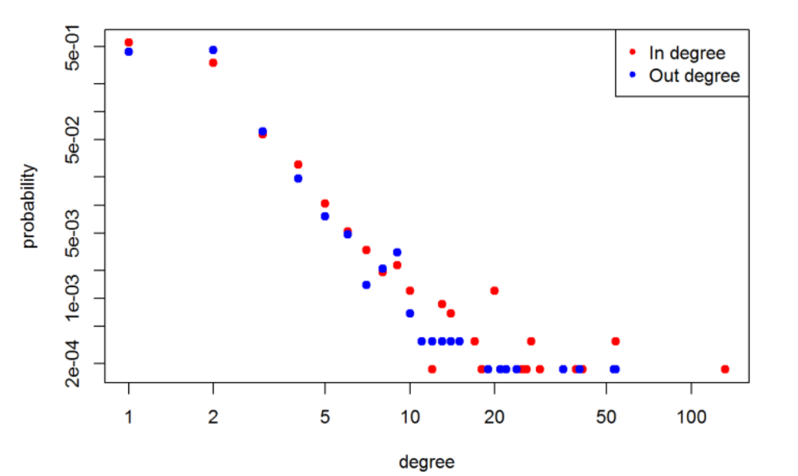

---

*Dear reader, way back in time I wrote a blog on how to use the Twitter API to collect data. It very out of data but here you go, the blog post [here](https://ecmiindmath.org/2015/12/21/hunting-for-ground-truths/).*

------------------------------------------------------------------------

My name is David O’Sullivan and I am currently pursuing a PhD in complex contagion on clustered networks. Many systems find a natural interpretation as a complex network where nodes identify the objects of the system and the links between nodes represent the presence of a relationship or interaction between those objects. Such network characterizations range from friendships on Facebook, connections between web-pages by hyper-links, to protein interaction networks in biological systems.

> A growing area of interest is the modelling of how behaviours diffuse across social networks, such as the adoption of innovations or the spreading of information.

Such research areas fall under the broad umbrella term of computational social science, which includes complex networks at its core. Throughout my PhD I have enjoyed many opportunities to work on a wide variety of industry problems. Each of these problems have had a useful common trait; the objective has been clearly defined in terms of a ground truth, whether it involves identifying bottle necks in a repair process, estimating energy consumption on an electricity grid, or correctly predicting customers who are likely to leave a service. In all these cases the final model has benefited greatly from having data available to validate and refine the model on.

> Throughout my PhD I have enjoyed many opportunities to work on a wide variety of industry problems. Each of these problems have had a useful common trait; the objective has been clearly defined in terms of a ground truth, whether it involves identifying bottle necks in a repair process, estimating energy consumption on an electricity grid, or correctly predicting customers who are likely to leave a service. In all these cases the final model has benefited greatly from having data available to validate and refine the model on.

Similarly in an academic setting once a model has been formulated, the value of the model is derived from its ability to predict the behaviour of the system. Necessitating the presence of observational or experimental results for comparisons. However, in computational social science this can prove to be problematic.

> Once a model has been formulated, say of how information spreads through a network, how can this model be validated beyond numerically simulating the system? Where can we get the ground truths for validation?

ne option would be to set up a specialised randomized control trial, a la [Damon Centola](https://www.science.org/doi/10.1126/science.1185231), to get some experimental data, however this requires significant expense and expertise to set up. Another possible option would be to do a population level analysis similar to work by [Sinan Aral](https://www.pnas.org/doi/abs/10.1073/pnas.0908800106), again however, this requires not only significant expertise to set up but also the access to population level data and infrastructure to handle such a large analysis. If our model is predicting specific features of a network, that might not be commonly reported in statistics papers then the solution is to collect specialised datasets. Thus, allowing the collection of the observations we need to validate our models and refine our theories. The widespread use of social media platforms such as Facebook, Reddit and Twitter to name of few provides a useful arena to observe social behaviours.

> Many of these social media platforms allow for easy access to at least part of the their data using their application program interfaces (API’s).

Suppose, for arguments sake, we have a model that predicts the [in and out degree distribution](https://en.wikipedia.org/wiki/Degree_distribution) of a social network and we want some empirical data to test the predictions against. The next section illustrates how to find such data with a minimal working example of data collection, cleaning and analysis from Twitter.

## Data collection

To access the twitter API you will need a valid Twitter account and then you will need to create a twitter app [here](https://developer.twitter.com/). Enter your apps name, a brief description, and a web address (you can use the URL for your twitter account or any valid webpage). Once you have created the app you will get a unique consumer key, consumer secret, access token and access secret. These act like your personal password to the app (save these somewhere safe for later). If you want a more detailed walk trough of this process please follow [this link](http://iag.me/socialmedia/how-to-create-a-twitter-app-in-8-easy-steps/).

R will be used for the analysis which can be downloaded [here](https://www.r-project.org/). I would also recommend downloading [RStudio](https://docs.posit.co/ide/user/#rstudio-ide-oss-downloads) which provides a powerful IDE for R. Now that we have the required key, secrets and token to the API and a valid installation of R we can now being to collect some tweets. The following code for R downloads some packages that we require from [CRAN](https://cran.r-project.org/) to process to process the collected tweets.

```{r}
#| eval: false

install.packages(c("streamR","ROAuth","stringr","igraph")) 
library("streamR")
library("ROAuth")
```

StreamR provides a series of simple functions to query the Twitter Stream API. The ROAuth takes all of the pain out of connecting to the API using our keys. Basically, OAuth is an authentication protocol that allows you to access the API without giving away your password. Its all a bit tecky and can be ignored. From our apps account we should have noted the various keys that we need to access the API. Running the following code with you unique keys creates a connection to the Twitter API. Following the on screen instructions and a successful connection should be established.

```{r}
#| eval: false

# save credentials
requestURL = "https://api.twitter.com/oauth/request_token"
accessURL = "https://api.twitter.com/oauth/access_token"
authURL = "https://api.twitter.com/oauth/authorize"
consumerKey = "PASTE_YOUR_CONSUMER_KEY_HERE"
consumerSecret = "PASTE_YOUR_CONSUMER_SECRET_HERE"

accessToken = "PASTE_YOUR_ACCESS_TOKEN_HERE"
accessSecret = "PASTE_YOUR_SECRET_HERE"

# set up handshake 
my_oauth = OAuthFactory$new(consumerKey = consumerKey, consumerSecret = consumerSecret, requestURL = requestURL, accessURL = accessURL, authURL = authURL)
my_oauth$handshake(cainfo = system.file("CurlSSL", "cacert.pem", package = "RCurl"))
```

You will be prompted to copy a web address into your browser, do so and on the webpage click “Authenticate”. Enter the retrieved code into your R console to validate the connection. We now have a valid connection that we can use to acquire data. Using this API access the data collection process begins using `filterStream`. This opens a connection to Twitter’s streaming API that will return a random sample of public statuses, around 1% at any given time. The data is saved in [JSON format](https://en.wikipedia.org/wiki/JSON) to the working directory specified in R. The following code collects tweets from the island of Ireland over the next hour (use `?filterstream` for details on function arguments). Once the code is set running its time for coffee/tea while the data is being collected.

```{r}
#| eval: false

filterStream("sampled_data.json",locations = c(-10.77,51.36,-5.22,55.52), timeout = 3600,oauth = my_oauth)
tweets_df = parseTweets("sampled_data.json")
```

The function `parseTweets` converts the JSON file into the `tweets_df` data frame that contains all the available information about the collected tweets. Using `names(twitter_df)` yields the variable names that are contained in the dataset. Now that we have gathered the data, the next section just gives a very brief example on cleaning.

## Building the network

We wish to extract how people are connected on twitter. A users tweets will often contain "@screen_name" in order to tag another user in a tweet. This is usually done as part of a conversation or to bring a users attention to a piece of information. To extract these values first we will standardise the text by transforming it all to lower-case and removing all non alpha numeric characters (while still keeping \@). Then we will extract all words prefixed by \@ and finally transform this into a matrix of who has tweeted at who. The following code parses the tweets, using the previously installed package `stringr`.

```{r}
#| eval: false

library( stringr )
cleaned_text = tolower( gsub("[^[:alnum:]@]", " ", tweets_df$text)) # keep only alpha numeric and @ symbols
atsymbol.regex = regex("(?<=^|\\s)@\\S+") #  create a regular expression search for 
atsymbol.list = str_extract_all( cleaned_text, atsymbol.regex )# extract all words with @ symbol
mentions = lapply(X = atsymbol.list, FUN = function(X){gsub(pattern = "@",replacement = "",x = X)}) # generate a list containing all @usernames for each tweet
names(mentions) = tolower(tweets_df$screen_name) 
graph_df = data.frame( from = names(unlist( mentions )), to = unlist( mentions )) # map list to a matrix
```

Using the igraph package which contains a whole suite of functions for network analysis, we can build the network. Once the network has been constructed it is possible to quickly calculate the in and out degree distribution of the network using some inbuilt functions.

```{r}
#| eval: false

library( igraph )
mentions_graph = graph.data.frame( graph_df, directed = TRUE )
plot( degree.distribution(graph = mentions_graph, mode = "out"), col = "red", pch = 20, cex = 1.5,
      log = "xy", xlab = "degree", ylab = "probability")
points( degree.distribution(graph = mentions_graph, mode = "in"), col = "blue", pch = 20, cex = 1.5 )
legend( "topright", col = c("red","blue"), pch = 20, c("In degree","Out degree") )
```



## Closing comments

Then, if we have a model, we just compare the results and see how our predictions hold up.

> The general point of all this is that the ability to gather your own data allows you the freedom and flexibility to create a convenient dataset for evaluation.

Even though this example is rather simplistic, it does highlight the ease at which data can be obtained. Removing the reliance on existing datasets and allowing for tailored dataset to be created. It also removes the cost associated with some expensive methods that were mentioned earlier in the blog.
