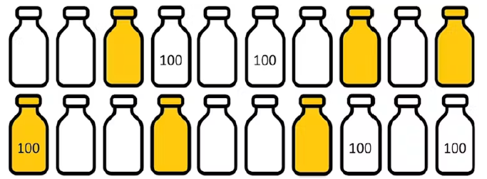
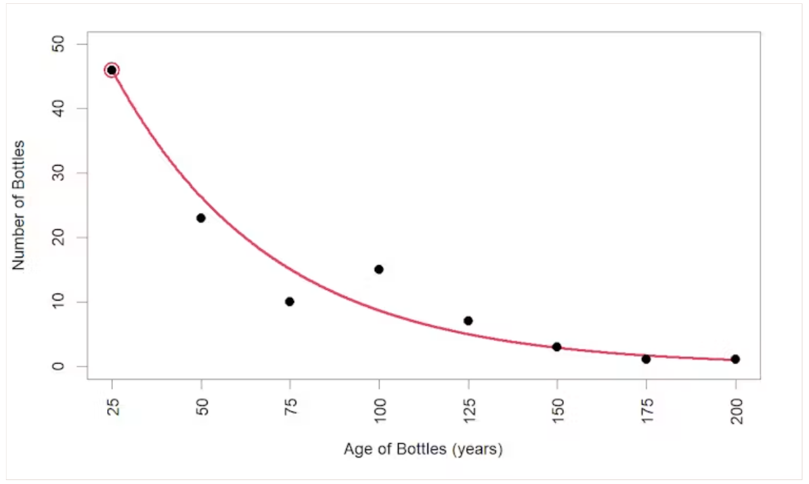

--- 
*This piece was co-written with Kevin Burke and originally published on [The Conversation](https://theconversation.com/what-is-the-chance-of-a-message-in-a-bottle-being-found-272122). You can read the original there.*

--- 

Recently, a cheerful 100-year-old message in a bottle was [found](https://theconversation.com/what-is-the-chance-of-a-message-in-a-bottle-being-found-272122) on the south-west coast of Australia. In it, a world war one soldier proclaimed to be "as happy as Larry".

If you're a betting person, you probably wouldn't expect great odds of this happening. A bottle cast into the ocean could end up absolutely anywhere.

If it floats to a remote location, there is little chance of somebody stumbling upon it. And if it lands somewhere more favourable where people could potentially find it, there are other issues. The message itself will deteriorate over time as light degrades it. If the bottle fills with water, it will sink and almost certainly never be found.

So, what are the chances of a message in a bottle being found and it being over 100? And what are your chances of finding this bottle?

## A straightforward calculation

Despite these many possibilities during a bottle's lifetime, the probability we are after is a straightforward calculation. Just count up the number of bottles with messages that have been found and are over 100 years old, and divide by the number of messages that have been sent this way (assuming we know how many are sent):

$$
\frac{\text{Bottles Found Over 100}}{\text{Total Bottles}}.
$$

Our diagram below shows a hypothetical situation where 20 bottles are sent in total, of which six are found (shown in gold) and one of these is over 100 years old (marked "100"). So, one in 20 bottles are found and over 100 years old. (Note: this is only a hypothetical calculation, not the real data.)

{fig-alt="A grid of 20 bottle icons; six are filled gold to represent bottles that were found, and two of those are labelled 100 to represent bottles found that are over 100 years old."}

## Splitting the problem in two

Instead of calculating the probability directly, another way to do it is by breaking the problem into two parts: (A) a bottle with a message is found, and (B) the found bottle is over 100. These two probabilities can be calculated separately and multiplied together to get what we want:

$$
\frac{\text{Bottles Found}}{\text{Total Bottles}} \times \frac{\text{Bottles Found Over 100}}{\text{Bottles Found}} = \frac{\text{Bottles Found Over 100}}{\text{Total Bottles}}.
$$

This is known as the "multiplication rule" of probability, and we confirm from our hypothetical numbers that $(6/20) \times (1/6) = 1/20$, as before.

Both approaches to calculating this probability are simple. However, the direct calculation requires knowing the total number of bottles sent out, which is very difficult to know in the real world.

The multiplication rule has the advantage that it breaks the calculation into two parts. We can tackle each separately, then bring the two results together to get the probability we want. This is useful in the real-world situation where we can draw information from different sources.

## Part A: the chance a bottle is found at all

First, we'll deal with the probability that a bottle with a message is found, irrespective of its age.

Experts from the Federal Maritime and Hydrographic Agency of Germany suggest a one in ten chance that a message in a bottle will be found. This aligns broadly with various historical "drift bottle" experiments, where oceanographers released large numbers of bottles to understand ocean currents.

For example, studies from the 1960s and '70s in the North Atlantic Ocean led to recovery rates of 14% from the Gulf of Mexico, 8% from the Caribbean Sea and 7% from the northern Brazilian coast. A more recent and more northerly study (between Canada and Greenland) from the 2000s led to a 5% recovery rate.

We would expect the results to vary naturally from different experiments in different parts of the world. But to keep things simple, we will stick with 1/10 as the probability that a bottle with a message is found.

## Part B: the chance a found bottle is over 100 years old

Now for the second piece of the calculation: of the bottles that are found, what proportion are over 100 years old?

The table below summarises data from news articles collected on Wikipedia about very old bottles with messages that have been found. However, only data on bottles over 25 years old has been collected, presumably because older bottles are more newsworthy.

| Age of found bottle | 0–25 yrs | 25–50 yrs | 50–75 yrs | 75–100 yrs | 100–125 yrs | 125–150 yrs | 150–175 yrs | 175–200 yrs |
|---|---|---|---|---|---|---|---|---|
| Bottles found | 46\* | 23 | 10 | 15 | 7 | 3 | 1 | 1 |

: Data on the age distribution of bottles found. The asterisk (\*) indicates an estimated number. {.striped}

So, we needed to estimate the number of 0- to 25-year-old bottles with messages ourselves.

The table shows that fewer bottles with messages are found as they get older. Messages in bottles degrade over time, which means the bottles have an increased chance of breaking and sinking, or just getting covered in layers of sediment. Plotting this data helped us see the trend in the ages of found bottles more clearly.

{fig-alt="Scatter plot of number of bottles found against age of bottle in years, from 25 to 200. The counts decline from 46 at 25 years down to 1 at 200 years, with a smooth red curve fitted through the points; the estimated point at 25 years is circled."}

We drew a line to match this observed trend in the ages of found bottles. This red line in the graph corresponds to the equation:

$$
\text{Bottles} = 80 \times 0.978^{\text{age}}
$$

This equation provides an estimate of how many bottles have been found for any specific age range (where 25 = 0-to-25, 50 = 25-to-50 and so on). We are interested in the 0- to 25-year-old bottles, so the equation suggests 46 bottles have been found in this range (the circled point).

Adding up this estimate and all of the numbers in the table gives a total of 106 bottles found, of which 12 are over 100 years old, and $12/106$ is about one in ten.

## Bringing it together

Recapping the above, we have that: (A) one in ten bottles with messages are found, of which (B) one in ten are over 100 years old. Bringing these results together using the multiplication rule, we estimate the chance of a message in a bottle being found and it being over 100 years old to be $(1/10) \times (1/10) = 1/100$.

So, if there are 100,000 bottles with messages floating around the oceans waiting to be found, we'd expect 1,000 of these to be found and be 100 or more years old. Assuming anybody in the world is equally likely to find one of these, with 8 billion people currently, that's about a one in 8 million chance of you finding one — pretty unlikely.

However, some people are more persistent at message-in-a-bottle hunting than others. Following the paths of ocean currents (known as gyres) could provide clues on where to look. Specifically, peninsulas or islands intersecting with these gyres could be good spots. For this reason, it has been suggested the Caribbean islands are ideally placed for finding bottles as they lie on the path of the North Atlantic Gyre. Which seems like a great reason to travel to the Caribbean!

But let's also spare a thought for the poor soul stranded on their desert island, who surely won't appreciate the low odds of their SOS being found.

---

DOI [10.64628/AB.c3gmg5xn6](https://doi.org/10.64628/AB.c3gmg5xn6)
