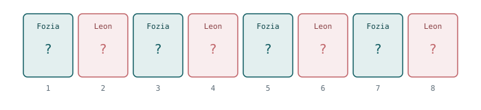
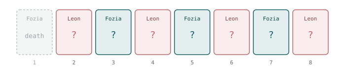

::: callout-warning
## Spoiler alert

This post discusses the outcome of a challenge in series 3 of The Traitors (UK), including who was murdered in episode 7. If you haven't watched it and intend to, look away now. But it was released in 2026 so...
:::

If you haven't seen it, *The Traitors* is a reality game show in which a group of contestants, the "faithful", try to complete challenges and build a prize fund, while a small number of them are secretly "traitors". Each night the traitors "murder" one of the faithful; each day the whole group votes to banish someone they suspect. The faithful win if they banish every traitor, and the traitors win if they survive to the end. Clearly, whoever created the show happened to have played/heard of games like [Werewolf](https://playwerewolf.co/pages/rules) or [Mafia](https://en.wikipedia.org/wiki/Mafia_(party_game)) and was like "I can make a TV series out of that!"

Anyway. I was watching Traitors and in series 3, the murder was handed over to a challenge called [Deathmatch](https://thetraitors.fandom.com/wiki/Death_Match). The traitors selected four faithful (Alexander, Anna, Fozia and Leon) to play a card game in which one player would end up being murdered. Anna and Alexander got out safely and left Fozia and Leon head to head, which took the form of a different card game.

The final round had the following form: Eight cards were face down, exactly one of them was a "life" card; the rest were "death". The two players took turns turning over a single card at a time. Turn over the life card and you survive; turn over a death card and play passes to your opponent. Fozia elected to go first.

She turned over a death card. And as I sat watching, I found myself thinking: *"Has she just screwed herself over by volunteering to go first?"* It's obvious to me now, but at the time my gut said yes. As it turns out the question has two quite different answers depending on exactly when you ask it (and I got it wrong in the moment).

# First question: is the game fair to begin with? {#sec-fair}

Before anything is turned over, what is the chance Fozia ultimately survives? She survives if she is the one to find the life card. That happens if she finds it on her first turn, or if she misses and Leon misses and she finds it on her second turn, or ... and so on (you're smart, you see the pattern). If we wish, we can actually compute the probability that Fozia survives by looking at the turn-by-turn behaviour of the game and just add up those disjoint cases:

$$\begin{aligned}
P(\text{Fozia survives}) &= P(\text{Fozia picks ``life" her first go}) \\
&+ P(\text{Fozia picks ``life" her second go}) \\ 
&+P(\text{Fozia picks ``life" her third go}) \\
&+ P(\text{Fozia picks ``life" her fourth go}).
\end{aligned}$$

Plugging in the numbers gives us:

$$\begin{aligned}
P(\text{Fozia survives}) &=
\underbrace{\frac{1}{8}}_{\text{turn 1}}
+
\underbrace{\frac{7}{8}\times\frac{6}{7}\times\frac{1}{6}}_{\text{turn 3}}
+
\underbrace{\frac{7}{8}\times\frac{6}{7}\times\frac{5}{6}\times\frac{4}{5}\times\frac{1}{4}}_{\text{turn 5}}
\\
&+
\underbrace{\frac{7}{8}\times\frac{6}{7}\times\frac{5}{6}\times\frac{4}{5}\times\frac{3}{4}\times\frac{2}{3}\times\frac{1}{2}}_{\text{turn 7}}
\end{aligned}$$

Each term is a chain of "everyone missed until now, and then she hit it". Taking the second term as the worked example, the three factors are exactly:

$$\overbrace{\frac{7}{8}}^{\substack{\text{Fozia fails} \\ \text{on the 1st}}}
\;\times\;
\overbrace{\frac{6}{7}}^{\substack{\text{Leon fails} \\ \text{on the 2nd}}}
\;\times\;
\overbrace{\frac{1}{6}}^{\substack{\text{Fozia succeeds} \\ \text{on the 3rd}}}
\;=\; \frac{1}{8}$$

We can see that numbers like the $7$'s and $6$'s cancel above and the product collapses to exactly $1/8$. We can note that this is the case for every term, a lot of cancellation until we are left with $1/8$. So we can take the $4$ terms each of which is $1/8$ and then

$$P(\text{Fozia survives}) = 4 \times \frac{1}{8} = \frac{1}{2}.$$

Ok, despite what I initially thought: going first neither helps nor hurts.

I should have probably sussed this a lot earlier. If we require a little more convincing we can also think of this like follows. The turn order never changes: Fozia turns over cards in positions $1, 3, 5, 7$ and Leon turns over cards in positions $2, 4, 6, 8$. If we think of each card falling into a slot, Fozia owns the odd slots and Leon owns the even slots, see (@fig-slots-fair). And if cards are randomly placed, then the life card is sitting in one uniformly random position out of eight, four of which are odd. So the answer is $4/8 = 1/2$, and by the same argument the game is fair for *any* even number of cards.

{#fig-slots-fair}

# Simulating it {#sec-sim}

The algebra is easy enough here, but it is always worth checking against a simulation. The idea is simple: build a deck with one `"life"` card and the rest `"death"`, shuffle it, then walk through it and see whose turn it was when the life card appeared. Run this "game" a bunch of times and see who pops out as being the winner.

```{r}
#| label: setup
#| message: false
#| warning: false
library(tidyverse)

set.seed(1234)
library(cowplot)
theme_set(theme_cowplot())

M <- 1000 # number of Monte Carlo replicates
```

The function below takes a `NOT_FIRST` flag. When it is `FALSE` (the default) we simulate the game exactly as described above. When it is `TRUE`, any deck that happened to put the life card in slot 1 gets that card moved to a uniformly chosen slot among the rest. This is one way that we can (and will) simulate the *conditional* game, given that the first card turned over was a death card. Just a note: we are going to ignore the flag entirely for now and come back to it in @sec-conditional.

```{r}
#| label: functions
simulate_single_round <- function(number_cards = 8, NOT_FIRST = FALSE){
  deck <-
    c("life", rep("death", number_cards - 1)) |>
    sample(size = number_cards)

  # only used later: condition on the life card not being in slot 1 by
  # moving it to a uniformly chosen slot among 2, ..., number_cards
  if(NOT_FIRST == TRUE & deck[1] == "life"){
    new_life_place <- sample((2:number_cards), size = 1)
    deck[new_life_place] <- "life"
    deck[1] <- "death"
  }

  whose_turn <- rep(c("fozia", "leon"), number_cards/2)
  who_won <- character(1)

  for(i in 1:length(deck)) {
    if(deck[i] == "life"){
      who_won <- whose_turn[i]
      break
    }
  }
  return(who_won)
}

run_mc_simulations <- function(M = 100, ...){
  mc_results <- character(M)
  for(i in 1:M){
    mc_results[i] <- simulate_single_round(...)
  }
  return(mc_results)
}
```

Running the eight-card game `r M` times:

```{r}
#| label: eight-card-fair
mc_results <- tibble(who_won = run_mc_simulations(M = M, number_cards = 8))

mc_results |>
  count(who_won) |>
  mutate(per = n/sum(n))
```

Close enough to 50:50. With $M = 1000$ replicates we don't expect exactly 50%, in fact it would be a little strange if we did, but over 1000 trials (or simulations) it should be very close to the true answer. Using this, we can sweep through a series of even deck sizes to confirm that it is always the case that the game is fair:

```{r}
#| label: sweep-fair
sweep_fair <- tibble(number_cards = 2*(1:10), sim = NA)

for(i in 1:nrow(sweep_fair)){
  mc_res <- run_mc_simulations(M = M, number_cards = sweep_fair$number_cards[i])
  sweep_fair$sim[i] <- sum(mc_res == "fozia")/length(mc_res)
}

sweep_fair <- sweep_fair |> mutate(theory = 0.5)
sweep_fair
```

Plotting this table shows that the differences between the theory and the simulations are small (@fig-fair).

```{r}
#| echo: false
#| label: fig-fair
#| fig-cap: "Simulated versus theoretical probability that the player going first survives. The game is fair at every deck size. The scatter around 50% is Monte Carlo noise."
#| fig-width: 7
#| fig-height: 4
ggplot(sweep_fair, aes(x = number_cards)) +
  geom_line(aes(y = theory, colour = "Theory"), linewidth = 0.8) +
  geom_point(aes(y = sim, colour = "Simulation"), size = 2.5) +
  scale_colour_manual(values = c("Theory" = "#135E63", "Simulation" = "#C1666B")) +
  scale_x_continuous(breaks = 2*(1:10)) +
  coord_cartesian(ylim = c(0, 1)) +
  labs(x = "Number of cards", y = "P(Fozia survives)", colour = NULL)
```

# Second question: what about *after* that first card? {#sec-conditional}

Ok the game is fair, great, I was wrong, but why was I wrong? The last couple of sections above were actually answering a slightly different question to what I was asking myself while watching. And this is how I confused myself (not an unheard-of occurrence).

By the time the thought had formed in my head that the game was unfair, the first card had already been turned over --- and it was a death card. That is new information, and it changes the problem, see the updated figure (@fig-slots-cond). We are no longer asking about the game from the fair starting point; we are asking a *conditional* question: given that slot 1 was not the life card, what is the chance Fozia goes on to survive?

{#fig-slots-cond}

We can reuse the sum from @sec-fair, but two things change. First, the turn-1 term is set to zero. We are conditioning on exactly that card being a death card, so she cannot win there. Second, every remaining term loses its leading $\tfrac{7}{8}$ factor, that factor *was* the probability that the first card was a death card. Now we are taking it as *given* (it is certain to happen) rather than factoring in the chance it happens. The chains all start from Leon's turn instead, with seven cards still in play:

$$\begin{aligned}
P(\text{Fozia survives} \mid \text{card 1 was death}) &=
\underbrace{0}_{\text{turn 1}}
+
\underbrace{\frac{6}{7}\times\frac{1}{6}}_{\text{turn 3}}
+
\underbrace{\frac{6}{7}\times\frac{5}{6}\times\frac{4}{5}\times\frac{1}{4}}_{\text{turn 5}}
\\&
+\underbrace{\frac{6}{7}\times\frac{5}{6}\times\frac{4}{5}\times\frac{3}{4}\times\frac{2}{3}\times\frac{1}{2}}_{\text{turn 7}}.
\end{aligned}$$

The same telescoping happens, except now each surviving product collapses to $1/7$ rather than $1/8$ --- and, there are only three of them left instead of four:

$$\begin{aligned}
P(\text{Fozia survives} \mid \text{card 1 was death}) 
&=0 + \frac{1}{7} + \frac{1}{7} + \frac{1}{7} \\
&= \frac{3}{7} \approx 0.429,
\end{aligned}$$

and Leon is now sitting on $4/7 \approx 0.571$.

The odd/even framing that we used earlier makes it obvious why, and gets to the same answer. The life card is now uniformly spread over the seven remaining slots, of which Fozia owns just three (3, 5 and 7) while Leon still owns all four of his (2, 4, 6 and 8). Therefore, Fozia has $3/7$ chance of selecting a life card. The two players started with an equal number of slots, and the effect of that first unsuccessful flip is to permanently destroy one of *Fozia's* slots and none of Leon's. From that point on she is playing at a disadvantage.

We can also work this out for a general deck of $2n$ cards, the same argument gives

$$P(\text{Fozia survives} \mid \text{card 1 was death}) = \frac{n-1}{2n-1}.$$

This is where the `NOT_FIRST` flag from @sec-sim comes in, the one that we ignored earlier. Switching it on reproduces exactly this:

```{r}
#| label: eight-card-conditional
mc_results <- tibble(
  who_won = run_mc_simulations(M = M, number_cards = 8, NOT_FIRST = TRUE)
)

mc_results |>
  count(who_won) |>
  mutate(per = n/sum(n))
```

Fozia lands near $3/7 \approx 0.429$ rather than a half. Again we can sweep through different deck sizes, and compare against $(n-1)/(2n-1)$:

```{r}
#| label: sweep-conditional
sweep_cond <- tibble(number_cards = 2*(2:15), sim = NA)

for(i in 1:nrow(sweep_cond)){
  mc_res <- run_mc_simulations(M = M,
                               number_cards = sweep_cond$number_cards[i],
                               NOT_FIRST = TRUE)
  sweep_cond$sim[i] <- sum(mc_res == "fozia")/length(mc_res)
}

sweep_cond <- sweep_cond |>
  mutate(n = number_cards/2,
         theory = (n - 1)/(2*n - 1))

sweep_cond
```

We can see in @fig-conditional how well our theory matches the simulations.

```{r}
#| echo: false
#| label: fig-conditional
#| fig-cap: "Once the first card is known to be a death card, the player who went first is at a lasting disadvantage. The penalty is worst for small decks and decays towards a half as the deck grows, but never reaches it."
#| fig-width: 7
#| fig-height: 4
ggplot(sweep_cond, aes(x = number_cards)) +
  geom_hline(yintercept = 0.5, linetype = "dashed", colour = "grey60") +
  geom_line(aes(y = theory, colour = "Theory"), linewidth = 0.8) +
  geom_point(aes(y = sim, colour = "Simulation"), size = 2.5) +
  scale_colour_manual(values = c("Theory" = "#135E63", "Simulation" = "#C1666B")) +
  scale_x_continuous(breaks = 2*(2:15)) +
  coord_cartesian(ylim = c(0, 1)) +
  labs(x = "Number of cards", y = "P(Fozia survives | first card was death)",
       colour = NULL)
```

Simulation and theory agree pretty well. If we have a look at @tbl-survival we can see how the full game and the conditional game compares

| Cards | Unconditional | Conditional on first card being death |
|------:|--------------:|--------------------------------------:|
|     2 |           1/2 |                                     0 |
|     4 |           1/2 |                           1/3 ≈ 0.333 |
|     6 |           1/2 |                           2/5 = 0.400 |
|     8 |           1/2 |                       **3/7 ≈ 0.429** |
|    10 |           1/2 |                           4/9 ≈ 0.444 |
|    20 |           1/2 |                          9/19 ≈ 0.474 |
|    60 |           1/2 |                         29/59 ≈ 0.492 |

: Fozia's survival probability, before and after the first card is turned over.

The two-card case is a nice sanity check on the formula: with only two cards, if the first one is death then the second is certainly the life card, and Fozia has no chance at all. As the deck grows the penalty for missing the life card on the first draw shrinks. One burned slot matters less and less, and the conditional probability creeps back towards $1/2$ without ever quite reaching it.

# The TL;DR: did it matter?

No --- volunteering to go first was not a mistake. At the moment she made that choice the game was fair, and she had exactly the same 50% shot as Leon, as @fig-fair shows. But once the first card was turned over her chances of winning dropped to 3/7. 
